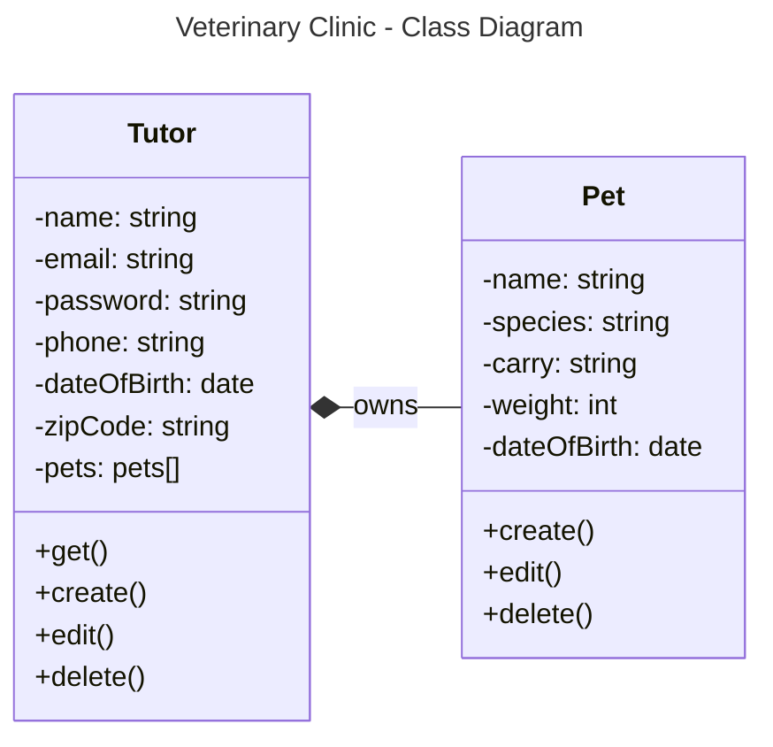
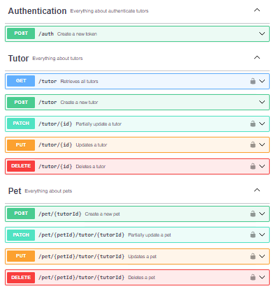

# Veterinary Clinic API
A Veterinary Clinic API for managing veterinary services.

## 💻 Overview
A Veterinary Clinic API built with Node.js and Express for managing veterinary services. A client needs a new microservice for its veterinary franchise. This microservice will be used by all the clinics they own for internal client and attendances management.

This project was made for a [Compass UOL](https://compass.uol/en/home/) challenge.

### 💿 Technologies


### 📊 Diagrams
<details open>
<summary><strong>Class Diagram</strong></summary>
<br/>


</details>

## 📄 Documentation
<div align="center">
    
</div>

The API documentation is available through Swagger. You can access it by opening the following URL in your web browser after starting the server: http://localhost:{PORT}/api-docs/

In the documentation, you can view request and response schemas, and even execute operations directly. It provides a convenient way to understand and interact with the API without the need for additional tools or clients.

## 🔀 API Reference

<details>
<summary><strong>Auth</strong></summary>
<br/>

| **Method** | **Route** | **Operation**     | **Authentication** |
|:----------:|-----------|-------------------|--------------------|
|    POST    | /auth     | Authenticate user | No                 |

</details>

<details>
<summary><strong>Tutor</strong></summary>
<br/>

| **Method** | **Route**   | **Operation**                       | **Authentication** |
|:----------:|-------------|-------------------------------------|--------------------|
|     GET    | /tutor      | Retrieves all tutors                | Yes                |
|    POST    | /tutor      | Create new tutor                    | No                 |
|    PATCH   | /tutor/{id} | Updates partially an existing tutor | Yes                |
|     PUT    | /tutor/{id} | Updates existing tutor              | Yes                |
|   DELETE   | /tutor/{id} | Delete an existing tutor            | Yes                |

</details>

<details>
<summary><strong>Pet</strong></summary>
<br/>

| **Method** | **Route**                    | **Operation**                    | **Authentication** |
|:----------:|------------------------------|----------------------------------|--------------------|
|    POST    | /pet/{tutorId}               | Create new pet                   | Yes                |
|    PATCH   | /pet/{petId}/tutor/{tutorId} | Updates partially a existing pet | Yes                |
|     PUT    | /pet/{petId}/tutor/{tutorId} | Updates existing pet             | Yes                |
|   DELETE   | /pet/{petId}/tutor/{tutorId} | Delete an existing pet           | Yes                |
</details>

## ⏬ Installation

<details>
<summary><strong>Inicial setup</strong></summary>
<br/>
    
To run this project locally, please follow these steps:
1. Clone the repository:
```bash
git clone <repository-url>
```

2. Navigate to the project directory:
```bash
cd <project-directory>
```

3. Install dependencies:
```bash
npm install
```

4. Generate files for a Prisma ORM data model: 
```bash
npm run database
```

5. Create a .env file in the root directory of the project (you can use the [exemple](https://github.com/felipecomarques/compass-challenge-01/blob/main/.env.example) in the root folder):
```
DATABASE_URL=<your-mongo-uri>
PORT=<your-port>
JWT_SECRET=<your-jwt-secret>
```
</details>

<details>
<summary><strong>Use development environment</strong></summary>
<br/>
    
1. Start the development server:
```bash
npm run dev
```

The server will start running on http://localhost:{PORT}. You can access the application by opening this URL in your web browser.
</details>

<details>
<summary><strong>Use production environment</strong></summary>
<br/>

1. Build the app to JavaScript:
```bash
npm run build
```

2. Start the production server:
```bash
npm start
```
The server will start running on http://localhost:{PORT}. You can access the application by opening this URL in your web browser.
</details>

## ⚖️ License
Code released under the [MIT LICENSE](https://github.com/felipecomarques/compass-challenge-01/blob/main/LICENSE).
